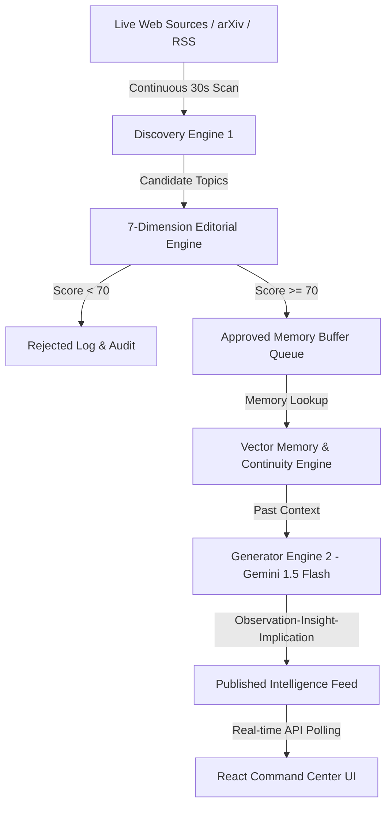

# NAVARACHNA

> **Autonomous Technology Intelligence Platform**  
> *"Discover. Evaluate. Remember. Publish."*

Navarachna is an **Autonomous Technology Intelligence Platform**. It is NOT a chatbot, AI influencer, or generic news summarizer. It is an autonomous intelligence agent that operates independently after a single initialization request—continuously discovering, scoring, remembering, and publishing domain-specific technology analysis over a multi-day timeline.

---

## 🏛️ System Architecture



---

## 🔄 Autonomous Workflow

The platform operates through a 6-stage continuous loop:

1. **Discovery**: Live RSS feeds (arXiv research preprints, IEEE Spectrum, Hacker News, TechCrunch) are scanned every 30 seconds for candidates tailored to the selected domain.
2. **Evaluation**: Every candidate topic is scored across 7 weighted criteria (0–100 pts).
3. **Rejection or Approval**: Topics scoring below threshold (default 70/100) are filtered out with explicit rejection rationales. Topics scoring $\ge 70$ are buffered.
4. **Memory Check**: Incoming topics are checked against vector memory to prevent duplicates and retrieve past analytical context.
5. **Publishing Decision**: High-priority candidates are formatted into Observation-Insight-Implication executive reports.
6. **Feed Update**: Published reports stream live to the user interface and API feed endpoints.

---

## 📊 7-Dimension Editorial Scoring Engine

| Dimension | Weight | Description |
| :--- | :---: | :--- |
| **Domain Relevance** | 25 pts | Direct alignment with targeted field (e.g., Robotics, AI Security, Machine Learning) |
| **Industry Impact** | 20 pts | Potential to transform infrastructure, enterprise, or market adoption |
| **Novelty** | 15 pts | Breakthrough nature vs. incremental updates |
| **Long-Term Value** | 15 pts | Strategic relevance over multi-year horizon |
| **Source Quality** | 10 pts | Credibility of publishing source (e.g. arXiv peer preprint vs blog) |
| **Persona Alignment** | 10 pts | Match with configured analyst writing voice (e.g. Analyst, Futurist, Strategist) |
| **Uniqueness** | 5 pts | Distinctness from topics published in past cycles |

---

## 📂 Repository Structure

```
.
├── app/                  # FastAPI backend (api, db, schemas, services, main.py)
├── src/                  # React/Vite Frontend source (App.tsx, components/, hooks/, lib/)
├── docs/                 # Hackathon logs (AI_USAGE_LOG.md, PROMPT_HISTORY.md, DEVELOPMENT_JOURNAL.md)
├── index.html            # Vite HTML entry point
├── package.json          # Node dependencies
├── vite.config.ts        # Vite configuration
├── tsconfig.json         # TypeScript configuration
├── Dockerfile            # Production container specification
├── render.yaml           # Render Blueprint specification
├── requirements.txt      # Python dependencies
└── README.md             # Platform documentation
```

---

## 🛠️ API Specification

### 1. Initialize Agent
`POST /api/agent/init`

```json
{
  "persona": {
    "name": "Navarachna",
    "domain": "Robotics",
    "style": "Analyst"
  }
}
```

### 2. Fetch Agent Feed
`GET /api/agent/feed?agentId={agentId}`

### 3. Fetch Priority Queue
`GET /api/agent/queue?agentId={agentId}`

### 4. Fetch Activity & Status Log
`GET /api/agent/status?agentId={agentId}`

---

## ⚙️ Local Development Setup

```bash
# 1. Install Dependencies
pip install -r requirements.txt

# 2. Set Environment Variables
# Copy .env.example to .env and set GEMINI_API_KEY if available

# 3. Run FastAPI Backend Server
uvicorn app.main:app --host 0.0.0.0 --port 8000
```

Access the UI at `http://localhost:8000`. Interactive Swagger docs available at `http://localhost:8000/docs`.

---

## ⚡ Live Steer Challenge Preparedness

Navarachna's architecture is strictly modularized into decoupled services (`discovery`, `editorial`, `memory`, `generator`, `scheduler_tasks`). During a live judging steer challenge, new candidate sources, scoring rules, or persona capabilities can be added rapidly within 20 minutes without refactoring core background loops.
